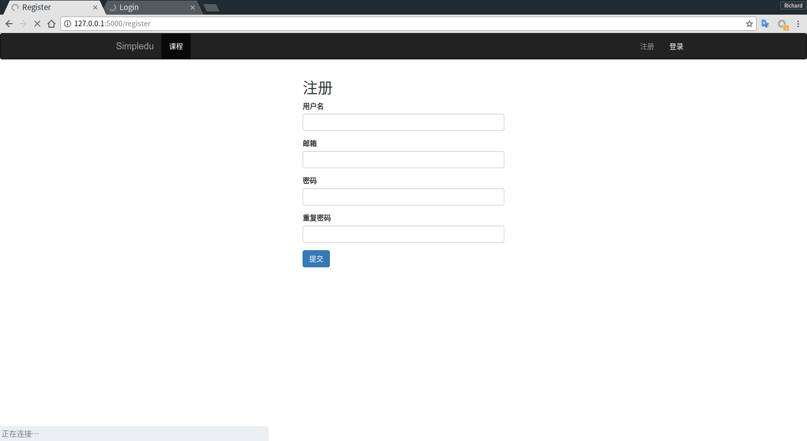
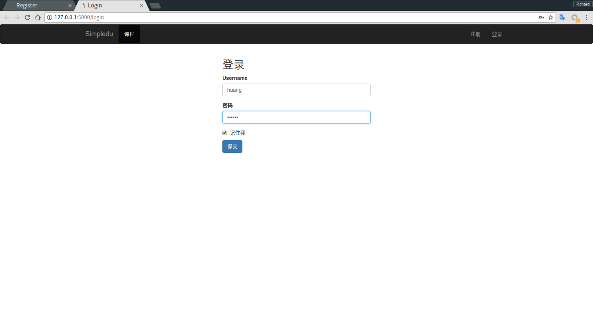
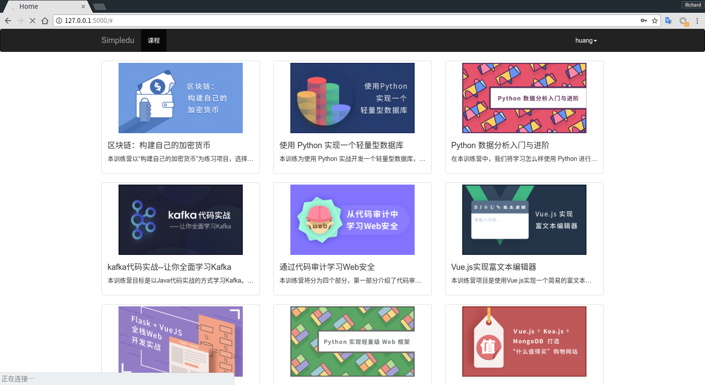
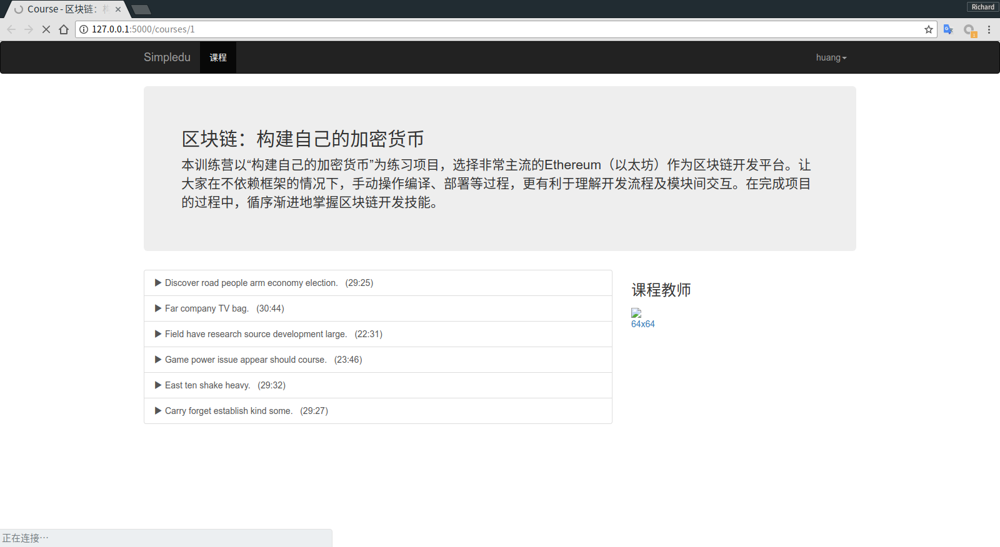
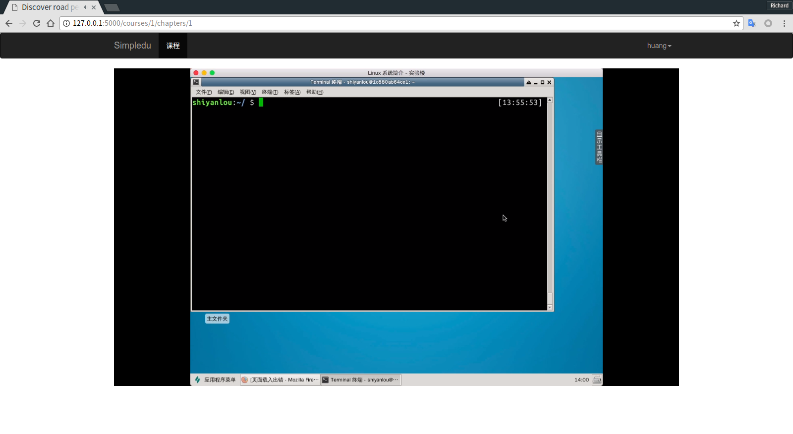
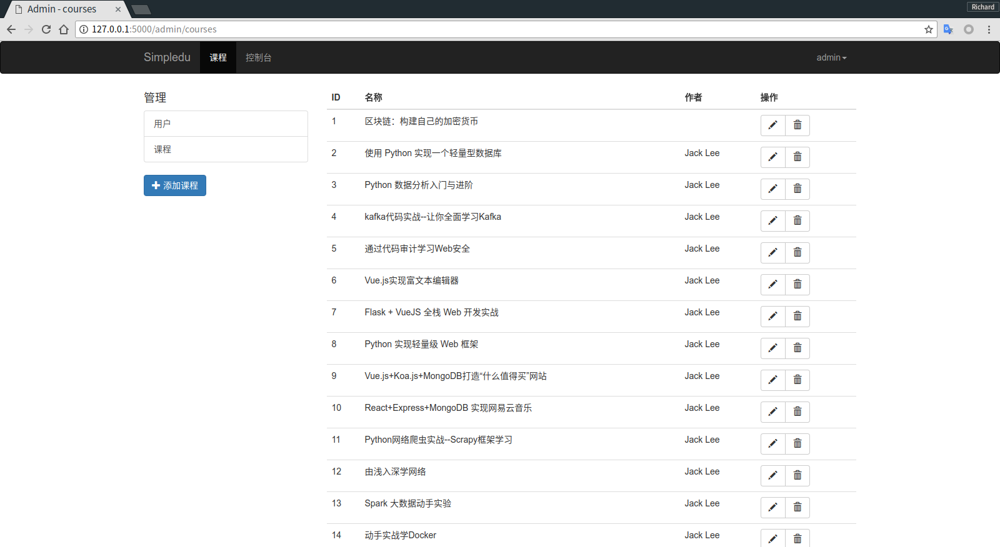
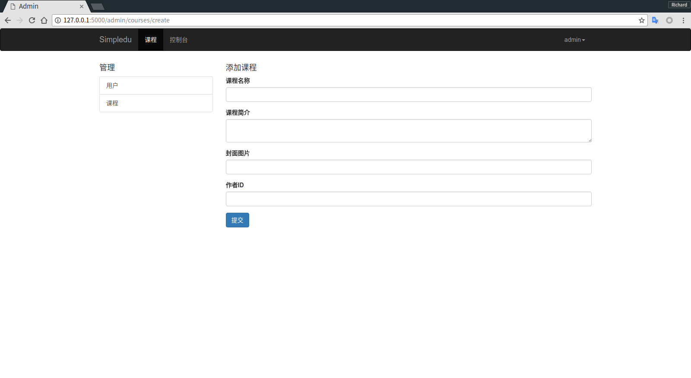

# simpledu

## 应用简介

一个简单的在线教育网站，实现了:
- 用户的登录注册功能
- 课程列表和课程详情功能
- 视频播放功能
- 后台管理功能（对课程和用户信息的增删改）

使用的技术：
- flask 框架
- mysql
- jinjia 模板
- bootstrap

## 启动应用

基于 Python3 开发，通过 virtualenv 建立开发环境
```bash
$ virtualenv -p python3 venv
$ source venv/bin/activate
$ pip install -r requirements.txt
```
依赖软件包安装完成后，创建数据库和表，再添加测试数据：
```bash
mysql> create database simpledu;
$ export FLASK_APP=manage.py
$ flask db upgrade
$ flask shell
>>> from scripts.generate_test_datas import run
>>> run()
$ flask run
```
接着访问 http://127.0.0.1:5000 查看效果。

## 应用演示

### 用户的登录注册功能


### 课程列表和课程详情功能


### 视频播放功能

### 后台管理功能（对课程和用户信息的增删改）

